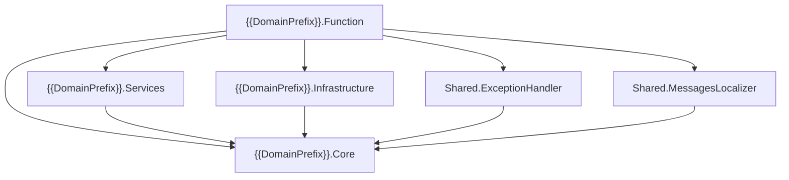

# Azure Functions — Clean Architecture Project Template

> **Instrucciones para IA / GitHub Copilot / VS Code**
> Este archivo es una plantilla configurable para crear nuevos proyectos de tipo **Azure Functions (Isolated Worker)** siguiendo **Clean Architecture**, **Hexagonal Architecture** y principios **SOLID**.

---

## 🔧 Variables de Configuración

Antes de generar el proyecto, **reemplaza todos los placeholders** siguientes con los valores reales:

| Placeholder | Descripción | Ejemplo |
|---|---|---|
| `{{SolutionName}}` | Nombre de la solución .sln | `Fn_Inventario_Backend` |
| `{{DomainName}}` | Nombre del dominio/contexto principal | `Inventario` |
| `{{DomainPrefix}}` | Prefijo del namespace (puede incluir empresa) | `Acme.Inventario` |
| `{{DatabaseProvider}}` | Proveedor EF Core (`Npgsql.EntityFrameworkCore.PostgreSQL`, `Microsoft.EntityFrameworkCore.SqlServer`, etc.) | `Npgsql.EntityFrameworkCore.PostgreSQL` |
| `{{DatabaseProviderVersion}}` | Versión del paquete EF Core del proveedor | `9.0.4` |
| `{{DbContextName}}` | Nombre del DbContext | `InventarioContext` |
| `{{ConnectionStringKey}}` | Nombre de la variable de entorno para la connection string | `ConnectionStrings__DefaultDb` |

---

## 📦 Stack Tecnológico

| Componente | Versión / Especificación |
|---|---|
| **Target Framework** | `net10.0` |
| **Azure Functions** | v4 (Isolated Worker — `Microsoft.Azure.Functions.Worker`) |
| **ORM** | Entity Framework Core 10.x |
| **Serialización** | `System.Text.Json` (nativo, **NO usar Newtonsoft.Json**) |
| **DI** | `Microsoft.Extensions.DependencyInjection` |
| **Observabilidad** | Application Insights (`Microsoft.ApplicationInsights.WorkerService`) |
| **Nullable** | `enable` en todos los proyectos |
| **ImplicitUsings** | `enable` en todos los proyectos |

> [!IMPORTANT]
> Usa **únicamente** APIs y patrones de .NET 7+ en adelante. Está **prohibido** usar:
> - `Newtonsoft.Json` → usar `System.Text.Json`
> - `IAsyncDisposable` mal implementado → implementar correctamente con `await using`
> - Constructores tradicionales cuando se puede usar **primary constructors** (C# 12+)
> - `HttpClient` directo sin `IHttpClientFactory`
> - Propiedades `set` cuando se puede usar `init` o `required`

---

## 🏗️ Arquitectura de la Solución

### Estructura de Solution Folders

```
📁 {{SolutionName}}.sln
├── 📂 Backend/                          ← Solution Folder
│   ├── {{DomainPrefix}}.Core            ← Dominio puro (sin dependencias externas)
│   ├── {{DomainPrefix}}.Infrastructure  ← Implementaciones de persistencia
│   └── {{DomainPrefix}}.Services        ← Lógica de aplicación / casos de uso
├── 📂 Consumers/                        ← Solution Folder
│   └── {{DomainPrefix}}.Function        ← Azure Functions (punto de entrada)
└── 📂 Shared/                           ← Solution Folder
    ├── {{DomainPrefix}}.Shared.ExceptionHandler     ← Middleware de excepciones
    └── {{DomainPrefix}}.Shared.MessagesLocalizer    ← Localización de mensajes
```

### Regla de Dependencias (Clean Architecture)



> **Core NUNCA referencia a ningún otro proyecto.** Solo define abstracciones (interfaces) y entidades.

---

## 📂 Estructura de cada Proyecto

### 1. `{{DomainPrefix}}.Core` — Dominio Puro

```
{{DomainPrefix}}.Core/
├── Attributes/
│   └── HttpStatusCodeAttribute.cs
├── Constants/
│   └── MessagesKey.cs
├── Dto/
│   └── (DTOs organizados por feature/subdominios)
├── Entities/
│   └── (Entidades de EF Core)
├── Enums/
│   └── TypeCodeHttp.cs
├── Exceptions/
│   └── (Excepciones personalizadas con [HttpStatusCode])
├── Interfaces/
│   ├── Infrastructure/
│   │   ├── Transaccion/
│   │   │   ├── IAdd.cs
│   │   │   ├── IDelete.cs
│   │   │   ├── IEdit.cs
│   │   │   ├── IFind.cs
│   │   │   ├── IFindAsync.cs
│   │   │   ├── ILists.cs
│   │   │   ├── ISaveTransaccion.cs
│   │   │   ├── ITransaction.cs
│   │   │   ├── ICommandRepository.cs
│   │   │   ├── ICommandReadQuery.cs
│   │   │   └── IQueryableExtensions.cs
│   │   └── I{{Entidad}}Repository.cs (uno por entidad relevante)
│   ├── Services/
│   │   └── I{{Feature}}Service.cs (uno por caso de uso)
│   └── Shared/
│       └── IMessagesLocalizer.cs
├── Models/
│   ├── PagedResult.cs
│   └── (Modelos de respuesta/vista)
├── GlobalUsings.cs
└── {{DomainPrefix}}.Core.csproj
```

**csproj:**

```xml
<Project Sdk="Microsoft.NET.Sdk">
  <PropertyGroup>
    <TargetFramework>net10.0</TargetFramework>
    <ImplicitUsings>enable</ImplicitUsings>
    <Nullable>enable</Nullable>
  </PropertyGroup>
  <ItemGroup>
    <PackageReference Include="Microsoft.EntityFrameworkCore" Version="10.0.0" />
  </ItemGroup>
</Project>
```

> [!CAUTION]
> **Core NO debe tener referencias a otros proyectos.** Solo paquetes mínimos como `Microsoft.EntityFrameworkCore` para atributos de entidades.

---

### 2. `{{DomainPrefix}}.Infrastructure` — Persistencia

```
{{DomainPrefix}}.Infrastructure/
├── Data/
│   └── {{DbContextName}}.cs
├── Helpers/
│   └── (Helpers internos de infra)
├── Migrations/
│   └── (Migraciones EF Core)
├── Options/
│   └── {{DomainName}}DbOptions.cs
├── Repository/
│   ├── CommandRepository.cs          ← Base genérica
│   └── {{Entidad}}Repository.cs      ← Uno por entidad
├── DependencyContainer.cs
├── GlobalUsings.cs
└── {{DomainPrefix}}.Infrastructure.csproj
```

**csproj:**

```xml
<Project Sdk="Microsoft.NET.Sdk">
  <PropertyGroup>
    <TargetFramework>net10.0</TargetFramework>
    <ImplicitUsings>enable</ImplicitUsings>
    <Nullable>enable</Nullable>
  </PropertyGroup>
  <ItemGroup>
    <PackageReference Include="{{DatabaseProvider}}" Version="{{DatabaseProviderVersion}}" />
    <PackageReference Include="Microsoft.EntityFrameworkCore.Design" Version="10.0.0">
      <PrivateAssets>all</PrivateAssets>
      <IncludeAssets>runtime; build; native; contentfiles; analyzers; buildtransitive</IncludeAssets>
    </PackageReference>
  </ItemGroup>
  <ItemGroup>
    <ProjectReference Include="..\{{DomainPrefix}}.Core\{{DomainPrefix}}.Core.csproj" />
  </ItemGroup>
</Project>
```

---

### 3. `{{DomainPrefix}}.Services` — Casos de Uso

```
{{DomainPrefix}}.Services/
├── Helpers/
│   └── (Helpers de servicio)
├── Services/
│   └── {{Feature}}Service.cs  ← Implementaciones de IService
├── DependencyContainer.cs
├── GlobalUsings.cs
└── {{DomainPrefix}}.Services.csproj
```

**csproj:**

```xml
<Project Sdk="Microsoft.NET.Sdk">
  <PropertyGroup>
    <TargetFramework>net10.0</TargetFramework>
    <ImplicitUsings>enable</ImplicitUsings>
    <Nullable>enable</Nullable>
  </PropertyGroup>
  <ItemGroup>
    <PackageReference Include="Microsoft.Extensions.DependencyInjection.Abstractions" Version="10.0.0" />
    <PackageReference Include="Microsoft.Extensions.Http" Version="10.0.0" />
  </ItemGroup>
  <ItemGroup>
    <ProjectReference Include="..\{{DomainPrefix}}.Core\{{DomainPrefix}}.Core.csproj" />
  </ItemGroup>
</Project>
```

---

### 4. `{{DomainPrefix}}.Function` — Azure Functions (Entry Point)

```
{{DomainPrefix}}.Function/
├── Extended/
│   └── (Extension methods propios del Function host)
├── Function/
│   └── {{Feature}}Function.cs  ← Una clase por feature/controller
├── Helpers/
│   └── (Helpers del Function)
├── Properties/
│   └── launchSettings.json
├── GlobalUsings.cs
├── Program.cs
├── host.json
├── local.settings.json
└── {{DomainPrefix}}.Function.csproj
```

**csproj:**

```xml
<Project Sdk="Microsoft.NET.Sdk">
  <PropertyGroup>
    <TargetFramework>net10.0</TargetFramework>
    <AzureFunctionsVersion>v4</AzureFunctionsVersion>
    <OutputType>Exe</OutputType>
    <ImplicitUsings>enable</ImplicitUsings>
    <Nullable>enable</Nullable>
  </PropertyGroup>
  <ItemGroup>
    <FrameworkReference Include="Microsoft.AspNetCore.App" />
    <None Include="local.settings.json" />
    <PackageReference Include="Microsoft.ApplicationInsights.WorkerService" Version="2.23.0" />
    <PackageReference Include="Microsoft.Azure.Functions.Worker" Version="2.0.0" />
    <PackageReference Include="Microsoft.Azure.Functions.Worker.ApplicationInsights" Version="2.0.0" />
    <PackageReference Include="Microsoft.Azure.Functions.Worker.Extensions.Http.AspNetCore" Version="2.0.1" />
    <PackageReference Include="Microsoft.Azure.Functions.Worker.Sdk" Version="2.0.2" />
  </ItemGroup>
  <ItemGroup>
    <ProjectReference Include="..\{{DomainPrefix}}.Core\{{DomainPrefix}}.Core.csproj" />
    <ProjectReference Include="..\{{DomainPrefix}}.Infrastructure\{{DomainPrefix}}.Infrastructure.csproj" />
    <ProjectReference Include="..\{{DomainPrefix}}.Services\{{DomainPrefix}}.Services.csproj" />
    <ProjectReference Include="..\{{DomainPrefix}}.Shared.ExceptionHandler\{{DomainPrefix}}.Shared.ExceptionHandler.csproj" />
    <ProjectReference Include="..\{{DomainPrefix}}.Shared.MessagesLocalizer\{{DomainPrefix}}.Shared.MessagesLocalizer.csproj" />
  </ItemGroup>
</Project>
```

---

### 5. `{{DomainPrefix}}.Shared.ExceptionHandler` — Middleware de Excepciones

```
{{DomainPrefix}}.Shared.ExceptionHandler/
├── DependencyContainer.cs
├── ExceptionHandler.cs           ← Partial: helpers de ProblemDetails
├── ManagerExceptionHandler.cs    ← Partial: IFunctionsWorkerMiddleware
└── {{DomainPrefix}}.Shared.ExceptionHandler.csproj
```

**csproj:**

```xml
<Project Sdk="Microsoft.NET.Sdk">
  <PropertyGroup>
    <TargetFramework>net10.0</TargetFramework>
    <ImplicitUsings>enable</ImplicitUsings>
    <Nullable>enable</Nullable>
  </PropertyGroup>
  <ItemGroup>
    <FrameworkReference Include="Microsoft.AspNetCore.App" />
  </ItemGroup>
  <ItemGroup>
    <PackageReference Include="Microsoft.Azure.Functions.Worker.Extensions.Http" Version="3.1.0" />
    <PackageReference Include="Microsoft.Azure.Functions.Worker.Extensions.Http.AspNetCore" Version="2.0.1" />
  </ItemGroup>
  <ItemGroup>
    <ProjectReference Include="..\{{DomainPrefix}}.Core\{{DomainPrefix}}.Core.csproj" />
  </ItemGroup>
</Project>
```

---

### 6. `{{DomainPrefix}}.Shared.MessagesLocalizer` — Localización

```
{{DomainPrefix}}.Shared.MessagesLocalizer/
├── DependencyContainer.cs
├── MessagesLocalizer.cs
└── {{DomainPrefix}}.Shared.MessagesLocalizer.csproj
```

**csproj:**

```xml
<Project Sdk="Microsoft.NET.Sdk">
  <PropertyGroup>
    <TargetFramework>net10.0</TargetFramework>
    <ImplicitUsings>enable</ImplicitUsings>
    <Nullable>enable</Nullable>
  </PropertyGroup>
  <ItemGroup>
    <PackageReference Include="Microsoft.Extensions.DependencyInjection.Abstractions" Version="10.0.0" />
  </ItemGroup>
  <ItemGroup>
    <ProjectReference Include="..\{{DomainPrefix}}.Core\{{DomainPrefix}}.Core.csproj" />
  </ItemGroup>
</Project>
```

---

## 📝 Código Base — Boilerplate Obligatorio

### Core: `Attributes/HttpStatusCodeAttribute.cs`

```csharp
using {{DomainPrefix}}.Core.Enums;

namespace {{DomainPrefix}}.Core.Attributes;

[AttributeUsage(AttributeTargets.Class, Inherited = false, AllowMultiple = false)]
public sealed class HttpStatusCodeAttribute(TypeCodeHttp statusCode) : Attribute
{
    public TypeCodeHttp StatusCode { get; } = statusCode;
}
```

### Core: `Enums/TypeCodeHttp.cs`

```csharp
namespace {{DomainPrefix}}.Core.Enums;

public enum TypeCodeHttp
{
    Success = 200,
    Created = 201,
    Accepted = 202,
    NoContent = 204,
    BadRequest = 400,
    Unauthorized = 401,
    Forbidden = 403,
    NotFound = 404,
    MethodNotAllowed = 405,
    Conflict = 409,
    UnprocessableEntity = 422,
    InternalServerError = 500,
    NotImplemented = 501,
    BadGateway = 502,
    ServiceUnavailable = 503,
    GatewayTimeout = 504
}
```

### Core: `Interfaces/Shared/IMessagesLocalizer.cs`

```csharp
namespace {{DomainPrefix}}.Core.Interfaces.Shared;

public interface IMessagesLocalizer
{
    string this[string key] { get; }
}
```

### Core: `Interfaces/Infrastructure/Transaccion/IAdd.cs`

```csharp
namespace {{DomainPrefix}}.Core.Interfaces.Infrastructure.Transaccion;

public interface IAdd<TEntity> where TEntity : class
{
    Task AddAsync(TEntity entity);
    Task AddRangeAsync(TEntity[] entity);
    Task AddRangeAsync(IList<TEntity> entity);
}
```

### Core: `Interfaces/Infrastructure/Transaccion/IDelete.cs`

```csharp
using System.Linq.Expressions;

namespace {{DomainPrefix}}.Core.Interfaces.Infrastructure.Transaccion;

public interface IDelete<TEntity> where TEntity : class
{
    Task<bool> DeleteAsync(Expression<Func<TEntity, bool>> condition);
}
```

### Core: `Interfaces/Infrastructure/Transaccion/IEdit.cs`

```csharp
namespace {{DomainPrefix}}.Core.Interfaces.Infrastructure.Transaccion;

public interface IEdit<TEntity> where TEntity : class
{
    Task EditAsync(TEntity entity);
}
```

### Core: `Interfaces/Infrastructure/Transaccion/IFind.cs`

```csharp
using System.Linq.Expressions;

namespace {{DomainPrefix}}.Core.Interfaces.Infrastructure.Transaccion;

public interface IFind<TEntity> where TEntity : class
{
    IQueryable<TEntity> FindMany(Expression<Func<TEntity, bool>> expression);
    TEntity? FindOne(Expression<Func<TEntity, bool>> predicate);
}
```

### Core: `Interfaces/Infrastructure/Transaccion/IFindAsync.cs`

```csharp
using System.Linq.Expressions;

namespace {{DomainPrefix}}.Core.Interfaces.Infrastructure.Transaccion;

public interface IFindAsync<TEntity> where TEntity : class
{
    Task<List<TEntity>> FindManyAsync(Expression<Func<TEntity, bool>> expression, CancellationToken cancellationToken = default);
    Task<TEntity?> FindOneAsync(Expression<Func<TEntity, bool>> predicate, CancellationToken cancellationToken = default);
}
```

### Core: `Interfaces/Infrastructure/Transaccion/ILists.cs`

```csharp
namespace {{DomainPrefix}}.Core.Interfaces.Infrastructure.Transaccion;

public interface ILists<TEntity> where TEntity : class
{
    IQueryable<TEntity> ListAll();
}
```

### Core: `Interfaces/Infrastructure/Transaccion/ISaveTransaccion.cs`

```csharp
namespace {{DomainPrefix}}.Core.Interfaces.Infrastructure.Transaccion;

public interface ISaveTransaccion<TEntity> where TEntity : class
{
    Task SaveChanges(CancellationToken cancellationToken = default);
}
```

### Core: `Interfaces/Infrastructure/Transaccion/ITransaction.cs`

```csharp
namespace {{DomainPrefix}}.Core.Interfaces.Infrastructure.Transaccion;

public interface ITransaction<TEntity> where TEntity : class
{
    Task BeginTransaction(Func<Task> action);
}
```

### Core: `Interfaces/Infrastructure/Transaccion/ICommandRepository.cs`

```csharp
namespace {{DomainPrefix}}.Core.Interfaces.Infrastructure.Transaccion;

public interface ICommandRepository<TEntity> :
    IAdd<TEntity>,
    IDelete<TEntity>,
    IEdit<TEntity>,
    IFind<TEntity>,
    IFindAsync<TEntity>,
    ISaveTransaccion<TEntity>,
    ITransaction<TEntity>,
    IDisposable
    where TEntity : class
{
}
```

### Core: `Interfaces/Infrastructure/Transaccion/ICommandReadQuery.cs`

```csharp
namespace {{DomainPrefix}}.Core.Interfaces.Infrastructure.Transaccion;

public interface ICommandReadQuery<TEntity> : IFind<TEntity>, IDisposable
    where TEntity : class
{
}
```

### Core: `Interfaces/Infrastructure/Transaccion/IQueryableExtensions.cs`

```csharp
using Microsoft.EntityFrameworkCore;

namespace {{DomainPrefix}}.Core.Interfaces.Infrastructure.Transaccion;

public static class IQueryableExtensions
{
    public static async Task<PagedResult<T>> ToPagedListAsync<T>(
        this IQueryable<T> source,
        int pageNumber,
        int pageSize)
    {
        pageNumber = pageNumber < 1 ? 1 : pageNumber;
        pageSize = pageSize < 1 ? 10 : pageSize;

        var count = await source.CountAsync();
        var items = await source
            .Skip((pageNumber - 1) * pageSize)
            .Take(pageSize)
            .ToListAsync();

        return new PagedResult<T>(items, count, pageNumber, pageSize);
    }
}
```

### Core: `Models/PagedResult.cs`

```csharp
namespace {{DomainPrefix}}.Core.Models;

public class PagedResult<T>(List<T> items, int count, int pageNumber, int pageSize)
{
    public List<T> Items { get; init; } = items;
    public int PageNumber { get; init; } = pageNumber;
    public int TotalPages { get; init; } = (int)Math.Ceiling(count / (double)pageSize);
    public int TotalRecords { get; init; } = count;
}
```

### Core: `Models/LoggEventMessagesBody.cs`

```csharp
namespace {{DomainPrefix}}.Core.Models;

public sealed record LoggEventMessagesBody(string? Messages);
```

### Core: `Exceptions/DatabaseTransactionException.cs`

```csharp
using {{DomainPrefix}}.Core.Attributes;
using {{DomainPrefix}}.Core.Enums;

namespace {{DomainPrefix}}.Core.Exceptions;

[HttpStatusCode(TypeCodeHttp.InternalServerError)]
public class DatabaseTransactionException : Exception
{
    public DatabaseTransactionException() { }
    public DatabaseTransactionException(string? message) : base(message) { }
    public DatabaseTransactionException(string? message, Exception? innerException) : base(message, innerException) { }
}
```

### Core: `Constants/MessagesKey.cs` (placeholder para agregar keys)

```csharp
namespace {{DomainPrefix}}.Core.Constants;

public static class MessagesKey
{
    // Cada constante debe coincidir con el nombre de la clase Exception correspondiente
    public const string DatabaseTransactionException = nameof(DatabaseTransactionException);

    // Agregar keys conforme se creen nuevas excepciones:
    // public const string {{ExceptionName}} = nameof({{ExceptionName}});
}
```

### Core: `GlobalUsings.cs`

```csharp
global using Microsoft.EntityFrameworkCore;
global using {{DomainPrefix}}.Core.Models;
global using {{DomainPrefix}}.Core.Entities;
global using {{DomainPrefix}}.Core.Interfaces.Infrastructure.Transaccion;
```

---

### Infrastructure: `Repository/CommandRepository.cs`

```csharp
using System.Linq.Expressions;
using Microsoft.EntityFrameworkCore;
using {{DomainPrefix}}.Core.Exceptions;
using {{DomainPrefix}}.Core.Interfaces.Infrastructure.Transaccion;
using {{DomainPrefix}}.Infrastructure.Data;

namespace {{DomainPrefix}}.Infrastructure.Repository;

internal class CommandRepository<TEntity>({{DbContextName}} context) :
    ICommandRepository<TEntity>, IDisposable where TEntity : class
{
    public readonly {{DbContextName}} context = context;
    public readonly DbSet<TEntity> entity = context.Set<TEntity>();
    private bool _disposed;

    public async Task AddAsync(TEntity entity)
        => await this.entity.AddAsync(entity);

    public async Task AddRangeAsync(TEntity[] entity)
        => await this.entity.AddRangeAsync(entity);

    public async Task AddRangeAsync(IList<TEntity> entity)
        => await this.entity.AddRangeAsync(entity);

    public async Task BeginTransaction(Func<Task> action)
    {
        await using var transaction = await context.Database.BeginTransactionAsync();
        try
        {
            await action.Invoke();
            await transaction.CommitAsync();
        }
        catch
        {
            await transaction.RollbackAsync();
            throw new DatabaseTransactionException();
        }
    }

    public async Task<bool> DeleteAsync(Expression<Func<TEntity, bool>> condition)
    {
        var found = await entity.FirstOrDefaultAsync(condition);
        if (found is null)
            return false;
        entity.Remove(found);
        return true;
    }

    public Task EditAsync(TEntity entity)
    {
        this.entity.Attach(entity);
        this.entity.Entry(entity).State = EntityState.Modified;
        return Task.CompletedTask;
    }

    public IQueryable<TEntity> FindMany(Expression<Func<TEntity, bool>> expression)
        => entity.AsNoTracking().Where(expression);

    public async Task<List<TEntity>> FindManyAsync(
        Expression<Func<TEntity, bool>> expression,
        CancellationToken cancellationToken = default)
        => await entity.AsNoTracking().Where(expression).ToListAsync(cancellationToken);

    public async Task<TEntity?> FindOneAsync(
        Expression<Func<TEntity, bool>> predicate,
        CancellationToken cancellationToken = default)
        => await entity.AsNoTracking().FirstOrDefaultAsync(predicate, cancellationToken);

    public TEntity? FindOne(Expression<Func<TEntity, bool>> predicate)
        => entity.AsNoTracking().FirstOrDefault(predicate);

    public async Task SaveChanges(CancellationToken cancellationToken = default)
        => await context.SaveChangesAsync(cancellationToken);

    public void Dispose()
    {
        Dispose(true);
        GC.SuppressFinalize(this);
    }

    protected virtual void Dispose(bool disposing)
    {
        if (!_disposed)
        {
            if (disposing)
                context.Dispose();
            _disposed = true;
        }
    }
}
```

### Infrastructure: `Options/{{DomainName}}DbOptions.cs`

```csharp
namespace {{DomainPrefix}}.Infrastructure.Options;

public sealed class {{DomainName}}DbOptions
{
    public const string ConnectionStringKey = "{{ConnectionStringKey}}";
    public string? ConnectionString { get; set; }
}
```

### Infrastructure: `DependencyContainer.cs`

```csharp
using Microsoft.EntityFrameworkCore;
using Microsoft.Extensions.DependencyInjection;
using {{DomainPrefix}}.Infrastructure.Data;
using {{DomainPrefix}}.Infrastructure.Options;

namespace {{DomainPrefix}}.Infrastructure;

public static class DependencyContainer
{
    public static IServiceCollection Add{{DomainName}}DataServices(
        this IServiceCollection services,
        Action<{{DomainName}}DbOptions> configure)
    {
        {{DomainName}}DbOptions options = new();
        configure.Invoke(options);

        services.AddSingleton(options);

        services.AddDbContext<{{DbContextName}}>(opt => opt
            .UseNpgsql(options.ConnectionString) // ← Cambiar según DatabaseProvider
            .UseQueryTrackingBehavior(QueryTrackingBehavior.NoTracking)
        );

        // Registrar repositorios:
        // services.AddScoped<I{{Entidad}}Repository, {{Entidad}}Repository>();

        return services;
    }
}
```

### Infrastructure: `GlobalUsings.cs`

```csharp
global using {{DomainPrefix}}.Core.Entities;
global using {{DomainPrefix}}.Core.Interfaces.Infrastructure;
global using {{DomainPrefix}}.Infrastructure.Data;
global using Microsoft.EntityFrameworkCore;
global using {{DomainPrefix}}.Core.Models;
```

---

### Services: `DependencyContainer.cs`

```csharp
using Microsoft.Extensions.DependencyInjection;

namespace {{DomainPrefix}}.Services;

public static class DependencyContainer
{
    public static IServiceCollection Add{{DomainName}}Services(this IServiceCollection services)
    {
        // Registrar servicios:
        // services.AddScoped<I{{Feature}}Service, {{Feature}}Service>();

        // HttpClients con IHttpClientFactory:
        // services.AddHttpClient("{{ClientName}}", client =>
        // {
        //     client.Timeout = TimeSpan.FromSeconds(30);
        // });

        return services;
    }
}
```

### Services: `GlobalUsings.cs`

```csharp
global using Microsoft.Extensions.Logging;
global using System.Text.Json;
global using {{DomainPrefix}}.Core.Entities;
global using {{DomainPrefix}}.Core.Exceptions;
global using {{DomainPrefix}}.Core.Interfaces.Infrastructure;
global using {{DomainPrefix}}.Core.Interfaces.Services;
global using {{DomainPrefix}}.Core.Models;
```

---

### Shared.ExceptionHandler: `ManagerExceptionHandler.cs`

```csharp
using System.Reflection;
using System.Text.Json;
using Microsoft.AspNetCore.Http;
using Microsoft.AspNetCore.Mvc;
using Microsoft.Azure.Functions.Worker;
using Microsoft.Azure.Functions.Worker.Middleware;
using Microsoft.Extensions.Logging;
using {{DomainPrefix}}.Core.Attributes;
using {{DomainPrefix}}.Core.Interfaces.Shared;
using {{DomainPrefix}}.Core.Models;

namespace {{DomainPrefix}}.Shared.ExceptionHandler;

internal sealed class ManagerExceptionHandler(
    IMessagesLocalizer messagesLocalizer,
    ILogger<ManagerExceptionHandler> logger) : IFunctionsWorkerMiddleware
{
    public async Task Invoke(FunctionContext context, FunctionExecutionDelegate next)
    {
        var httpContext = context.GetHttpContext();
        try
        {
            await next(context);
        }
        catch (Exception exception)
        {
            var exceptionTypeName = exception.GetType().Name;
            var localizedMessage = messagesLocalizer[exceptionTypeName];
            var message = localizedMessage == exceptionTypeName
                ? exception.Message
                : localizedMessage;

            var statusCode = GetHttpStatusCode(exception);
            await WriteProblemDetailsAsync(httpContext, statusCode, message, exceptionTypeName);
        }
    }

    private static int GetHttpStatusCode(Exception exception)
    {
        var attribute = exception.GetType().GetCustomAttribute<HttpStatusCodeAttribute>();
        return attribute is not null ? (int)attribute.StatusCode : 500;
    }

    private async Task WriteProblemDetailsAsync(
        HttpContext? context,
        int statusCode,
        string title,
        string instance)
    {
        var problemDetails = new ProblemDetails
        {
            Status = statusCode,
            Type = statusCode >= 500
                ? "https://datatracker.ietf.org/doc/html/rfc7231#section-6.6.1"
                : "https://datatracker.ietf.org/doc/html/rfc7231#section-6.5.1",
            Title = title,
            Instance = $"problemDetails/{instance}"
        };

        var parsedBody = TryParseAsLogBody(problemDetails.Title);
        if (parsedBody is not null)
            problemDetails.Title = parsedBody.Messages;

        if (statusCode is >= 400 and < 500)
            logger.LogWarning("Warning: {ProblemDetails}", JsonSerializer.Serialize(problemDetails));
        else
            logger.LogError("Error: {ProblemDetails}", JsonSerializer.Serialize(problemDetails));

        if (context is not null)
        {
            context.Response.ContentType = "application/problem+json";
            context.Response.StatusCode = problemDetails.Status!.Value;
            await JsonSerializer.SerializeAsync(context.Response.Body, problemDetails);
        }
    }

    private static LoggEventMessagesBody? TryParseAsLogBody(string? title)
    {
        try
        {
            return title is not null
                ? JsonSerializer.Deserialize<LoggEventMessagesBody>(title)
                : null;
        }
        catch
        {
            return null;
        }
    }
}
```

### Shared.ExceptionHandler: `DependencyContainer.cs`

```csharp
using Microsoft.Azure.Functions.Worker;

namespace {{DomainPrefix}}.Shared.ExceptionHandler;

public static class DependencyContainer
{
    public static IFunctionsWorkerApplicationBuilder AddHandlerExceptionAutomate(
        this IFunctionsWorkerApplicationBuilder app)
    {
        app.UseMiddleware<ManagerExceptionHandler>();
        return app;
    }
}
```

---

### Shared.MessagesLocalizer: `MessagesLocalizer.cs`

```csharp
using {{DomainPrefix}}.Core.Constants;
using {{DomainPrefix}}.Core.Interfaces.Shared;

namespace {{DomainPrefix}}.Shared.MessagesLocalizer;

internal sealed class MessagesLocalizer : IMessagesLocalizer
{
    private readonly Dictionary<string, string> _messagesEs = new()
    {
        [MessagesKey.DatabaseTransactionException] =
            "La operación no pudo ser completada. Por favor, inténtalo de nuevo en unos momentos.",

        // Agregar mensajes conforme se creen excepciones:
        // [MessagesKey.{{ExceptionName}}] = "Mensaje localizado...",
    };

    public string this[string key]
    {
        get
        {
            _messagesEs.TryGetValue(key, out var value);
            return string.IsNullOrEmpty(value) ? key : value;
        }
    }
}
```

### Shared.MessagesLocalizer: `DependencyContainer.cs`

```csharp
using Microsoft.Extensions.DependencyInjection;
using {{DomainPrefix}}.Core.Interfaces.Shared;

namespace {{DomainPrefix}}.Shared.MessagesLocalizer;

public static class DependencyContainer
{
    public static IServiceCollection AddMessagesLocalizer(this IServiceCollection services)
    {
        services.AddSingleton<IMessagesLocalizer, MessagesLocalizer>();
        return services;
    }
}
```

---

### Function: `Program.cs`

```csharp
using Microsoft.Azure.Functions.Worker.Builder;
using Microsoft.Extensions.Configuration;
using Microsoft.Extensions.DependencyInjection;
using Microsoft.Extensions.Hosting;
using {{DomainPrefix}}.Infrastructure;
using {{DomainPrefix}}.Infrastructure.Options;
using {{DomainPrefix}}.Services;
using {{DomainPrefix}}.Shared.ExceptionHandler;
using {{DomainPrefix}}.Shared.MessagesLocalizer;

var host = new HostBuilder()
    .ConfigureFunctionsWebApplication(builder =>
    {
        builder.AddHandlerExceptionAutomate();
    })
    .ConfigureAppConfiguration((context, config) =>
    {
        config.AddJsonFile("local.settings.json", optional: true, reloadOnChange: true);
    })
    .ConfigureServices(services =>
    {
        services
            .AddApplicationInsightsTelemetryWorkerService()
            .ConfigureFunctionsApplicationInsights()
            .Add{{DomainName}}Services()
            .AddMessagesLocalizer()
            .Add{{DomainName}}DataServices(opt =>
                opt.ConnectionString = Environment.GetEnvironmentVariable(
                    {{DomainName}}DbOptions.ConnectionStringKey));
    })
    .Build();

host.Run();
```

### Function: `GlobalUsings.cs`

```csharp
global using Microsoft.AspNetCore.Http;
global using Microsoft.AspNetCore.Mvc;
global using Microsoft.Azure.Functions.Worker;
global using Microsoft.Extensions.Logging;
```

### Function: `host.json`

```json
{
  "version": "2.0",
  "extensions": {
    "http": { "routePrefix": "api" }
  },
  "logging": {
    "applicationInsights": {
      "samplingSettings": {
        "isEnabled": true,
        "excludedTypes": "Request"
      },
      "enableLiveMetricsFilters": true
    }
  }
}
```

### Function: `local.settings.json`

```json
{
  "IsEncrypted": false,
  "Values": {
    "AzureWebJobsStorage": "UseDevelopmentStorage=true",
    "FUNCTIONS_WORKER_RUNTIME": "dotnet-isolated",
    "{{ConnectionStringKey}}": "Host=localhost;Database={{DomainName}};Username=postgres;Password=secret"
  }
}
```

---

## 🎯 Patrones y Convenciones Obligatorias

### 1. Excepciones Personalizadas

Cada exception **debe** tener el atributo `[HttpStatusCode]`:

```csharp
using {{DomainPrefix}}.Core.Attributes;
using {{DomainPrefix}}.Core.Enums;

namespace {{DomainPrefix}}.Core.Exceptions;

[HttpStatusCode(TypeCodeHttp.NotFound)]
public class {{EntityName}}NotFoundException : Exception
{
    public {{EntityName}}NotFoundException() { }
    public {{EntityName}}NotFoundException(string? message) : base(message) { }
    public {{EntityName}}NotFoundException(string? message, Exception? innerException) : base(message, innerException) { }
}
```

> Al crear una new exception: (1) agregar key en `MessagesKey.cs`, (2) agregar mensaje en `MessagesLocalizer.cs`.

### 2. Repositorios

Cada repositorio hereda de `CommandRepository<TEntity>` y su interfaz de `ICommandRepository<TEntity>`:

```csharp
// Interfaz en Core/Interfaces/Infrastructure/
namespace {{DomainPrefix}}.Core.Interfaces.Infrastructure;

public interface I{{Entidad}}Repository : ICommandRepository<{{Entidad}}>
{
    // Métodos específicos de la entidad
    Task<{{Entidad}}?> FindByCodeAsync(string code, CancellationToken ct = default);
}
```

```csharp
// Implementación en Infrastructure/Repository/
namespace {{DomainPrefix}}.Infrastructure.Repository;

internal sealed class {{Entidad}}Repository({{DbContextName}} context)
    : CommandRepository<{{Entidad}}>(context), I{{Entidad}}Repository
{
    public async Task<{{Entidad}}?> FindByCodeAsync(string code, CancellationToken ct = default)
        => await entity.AsNoTracking().FirstOrDefaultAsync(x => x.Code == code, ct);
}
```

### 3. Servicios (Casos de Uso)

```csharp
// Interfaz en Core/Interfaces/Services/
namespace {{DomainPrefix}}.Core.Interfaces.Services;

public interface I{{Feature}}Service
{
    Task<PagedResult<{{Dto}}>> GetAllAsync(int page, int pageSize, CancellationToken ct = default);
    Task<{{Dto}}> GetByIdAsync(string id, CancellationToken ct = default);
    Task CreateAsync({{CreateDto}} dto, CancellationToken ct = default);
}
```

```csharp
// Implementación en Services/Services/
namespace {{DomainPrefix}}.Services.Services;

internal sealed class {{Feature}}Service(
    I{{Entidad}}Repository repository,
    ILogger<{{Feature}}Service> logger) : I{{Feature}}Service
{
    public async Task<PagedResult<{{Dto}}>> GetAllAsync(
        int page, int pageSize, CancellationToken ct = default)
    {
        var query = repository.FindMany(x => true);
        return await query.ToPagedListAsync(page, pageSize);
    }
    // ... implementar métodos
}
```

### 4. Azure Functions (Endpoints)

```csharp
namespace {{DomainPrefix}}.Function.Function;

public sealed class {{Feature}}Function(
    ILogger<{{Feature}}Function> logger,
    I{{Feature}}Service service)
{
    [Function("Get{{Feature}}s")]
    public async Task<IActionResult> GetAll(
        [HttpTrigger(AuthorizationLevel.Function, "get")] HttpRequest req,
        CancellationToken cancellationToken)
    {
        logger.LogInformation("Processing Get{{Feature}}s request");

        var page = int.TryParse(req.Query["page"], out var p) ? p : 1;
        var pageSize = int.TryParse(req.Query["pageSize"], out var ps) ? ps : 10;

        var result = await service.GetAllAsync(page, pageSize, cancellationToken);
        return new OkObjectResult(result);
    }

    [Function("Create{{Feature}}")]
    public async Task<IActionResult> Create(
        [HttpTrigger(AuthorizationLevel.Function, "post")] HttpRequest req,
        CancellationToken cancellationToken)
    {
        logger.LogInformation("Processing Create{{Feature}} request");

        var dto = await JsonSerializer.DeserializeAsync<{{CreateDto}}>(
            req.Body, cancellationToken: cancellationToken);

        await service.CreateAsync(dto!, cancellationToken);
        return new CreatedResult();
    }
}
```

### 5. DependencyContainer (Patrón de Extensión)

Cada proyecto expone un **extension method** en `DependencyContainer.cs`:
- Sin opciones: `public static IServiceCollection Add{{Name}}(this IServiceCollection services)`
- Con opciones: `public static IServiceCollection Add{{Name}}(this IServiceCollection services, Action<{{Options}}> configure)`

### 6. Consumer Projects (Servicios Externos)

Cuando se necesiten integraciones a servicios externos (APIs, CRM, Firebase, etc.), **crear un proyecto Consumer**:

```
{{DomainPrefix}}.{{ConsumerName}}/
├── Options/
│   └── {{ConsumerName}}Options.cs
├── Services/
│   └── {{ConsumerName}}Service.cs
├── Helpers/
│   └── (si aplica)
├── DependencyContainer.cs
└── {{DomainPrefix}}.{{ConsumerName}}.csproj
```

El csproj del Consumer solo debe referenciar a `Core`:

```xml
<ItemGroup>
  <ProjectReference Include="..\{{DomainPrefix}}.Core\{{DomainPrefix}}.Core.csproj" />
</ItemGroup>
```

La interfaz del Consumer se define en **Core** (`Interfaces/{{ConsumerName}}/I{{Service}}.cs`), y la implementación vive en el proyecto Consumer.

---

## ✅ Reglas de Código (SOLID + Modern .NET)

1. **File-scoped namespaces** — Usar `namespace X.Y.Z;` (no bloques `{ }`)
2. **Primary constructors** — Usar en clases y records cuando sea viable (C# 12+)
3. **`sealed`** — Marcar como `sealed` toda clase que no esté diseñada para herencia
4. **`internal`** — Implementaciones concretas de servicios/repositorios deben ser `internal`
5. **`init` / `required`** — Preferir sobre `set` en DTOs y Models
6. **`record`** — Usar para DTOs inmutables: `public sealed record {{Dto}}(string Prop1, int Prop2);`
7. **`CancellationToken`** — Propagarlo siempre en operaciones async
8. **No usar `async void`** — Siempre `async Task`
9. **`ConfigureAwait(false)`** — No necesario en .NET 8+ con Isolated Worker
10. **Logging estructurado** — `logger.LogInformation("Processing {Action}", actionName)` (no interpolación de strings)
11. **`IHttpClientFactory`** — Para cualquier llamada HTTP externa
12. **`System.Text.Json`** — Único serializador, configurar con `JsonSerializerOptions` si se necesitan opciones custom
13. **`AsNoTracking()`** — Por defecto en todas las consultas de lectura
14. **Global Usings** — Centralizar imports frecuentes en `GlobalUsings.cs` de cada proyecto
15. **Guard clauses** — Usar `ArgumentNullException.ThrowIfNull()` y `ArgumentException.ThrowIfNullOrWhiteSpace()`

---

## 🚀 Pasos para Crear un Nuevo Proyecto

1. Reemplazar TODOS los `{{placeholders}}` con los valores reales
2. Crear la solución: `dotnet new sln -n {{SolutionName}}`
3. Crear cada proyecto con `dotnet new classlib` / `dotnet new azurefunctions`
4. Agregar las referencias entre proyectos según el diagrama de dependencias
5. Copiar todo el boilerplate de la sección "Código Base"
6. Agregar entidades y DTOs propios del dominio en `Core`
7. Crear el `DbContext` en `Infrastructure/Data/`
8. Implementar los repositorios heredando de `CommandRepository<T>`
9. Implementar los servicios en `Services/Services/`
10. Crear las Functions en `Function/Function/`
11. Registrar todo en los `DependencyContainer.cs` correspondientes
12. Configurar `Program.cs` con la cadena de extensiones
13. Ejecutar: `dotnet build` → `func start`
